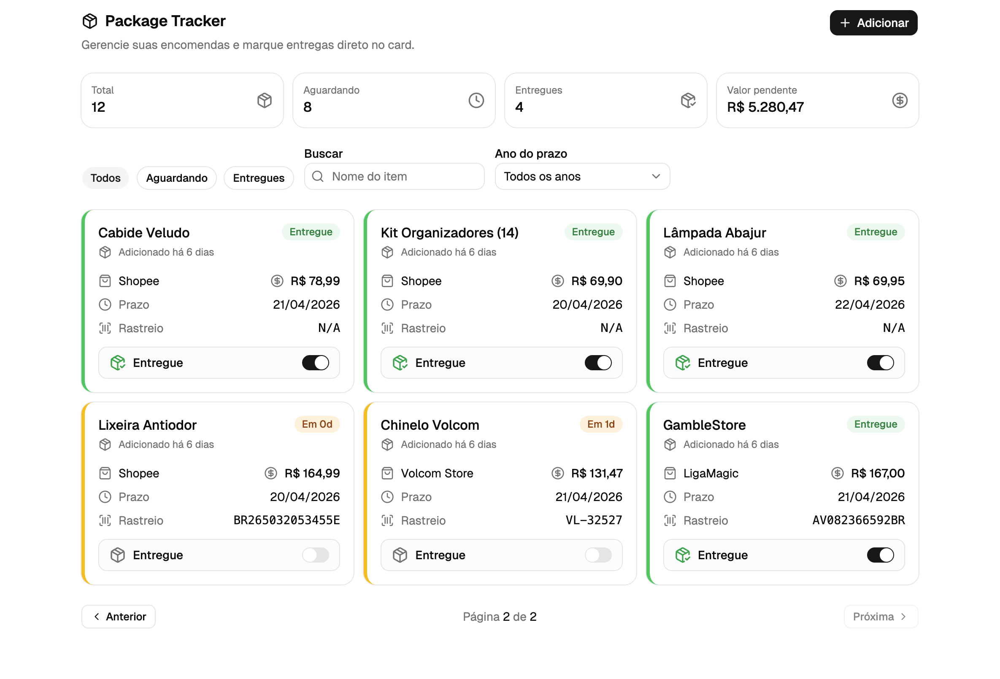

# Package Tracker

Aplicação web para gestão de encomendas, com foco em organização, acompanhamento de status e visão rápida dos pedidos cadastrados.

Este projeto foi desenvolvido para demonstrar boas práticas de front-end moderno, estrutura escalavel e experiencia de usuario objetiva.



## Objetivo do Projeto

O Package Tracker centraliza informacoes importantes de pedidos, permitindo:

- cadastro de novas encomendas;
- marcacao de entrega diretamente no card;
- filtros por status, busca por texto e filtro por ano;
- visao resumida com metricas de pedidos e valores pendentes.

## Principais Diferenciais Tecnicos

- Interface responsiva e componentizada com React + TypeScript.
- Gerenciamento de estado local com atualizacao otimista para melhor UX.
- Integracao com Supabase via HTTP para persistencia dos dados.
- Validacao de formulario com Zod e React Hook Form.
- Organizacao em camadas (componentes, hooks, controllers e services).

## Stack

- React 19
- TypeScript
- Vite
- Tailwind CSS 4
- TanStack Router
- Axios
- Supabase
- Zod
- React Hook Form

## Como Executar

### 1. Clone o repositorio

```bash
git clone <url-do-repositorio>
cd tracker
```

### 2. Instale as dependencias

```bash
npm install
```

### 3. Configure as variaveis de ambiente

Crie um arquivo `.env` na raiz do projeto com:

```env
VITE_SUPABASE_URL=
VITE_SUPABASE_PUBLISHABLE_KEY=
```

### 4. Rode o projeto em desenvolvimento

```bash
npm run dev
```

### 5. Build de producao

```bash
npm run build
npm run preview
```

## Qualidade de Codigo

- ESLint configurado para padronizacao e manutencao de qualidade.
- Arquitetura orientada a reaproveitamento de componentes.
- Separacao de responsabilidades para facilitar evolucao e manutencao.

## Autor

Julio Araujo  
Desenvolvedor Front-end
